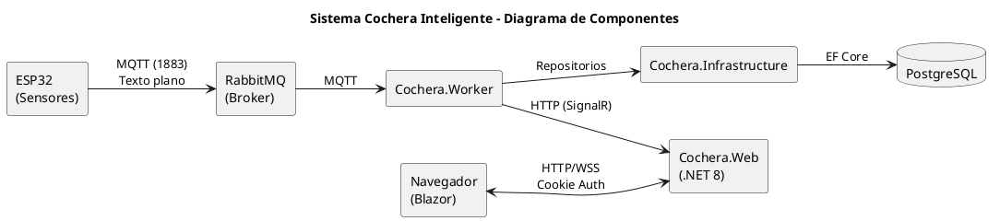
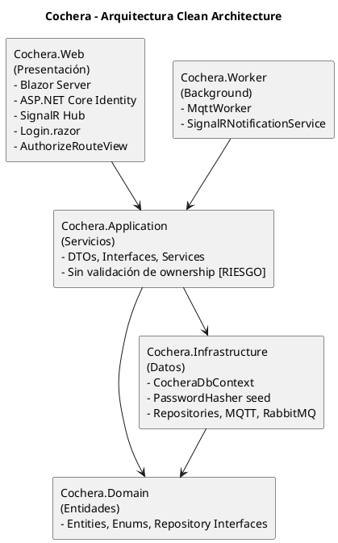
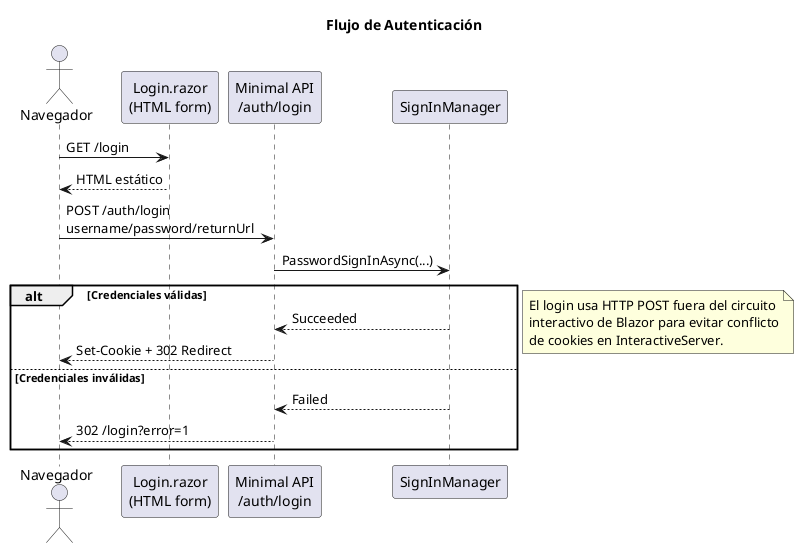
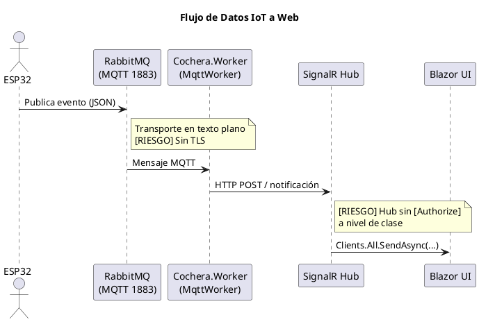
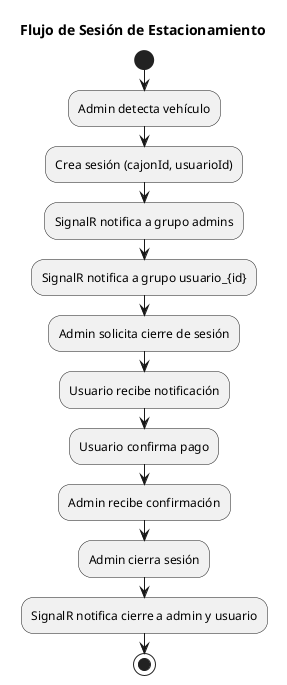

# 01 — Descripción del Sistema

## 1.1 Resumen Ejecutivo

**Cochera Inteligente** es un sistema de gestión de estacionamiento basado en IoT que integra sensores ultrasónicos (ESP32), un broker de mensajería MQTT (RabbitMQ), y una aplicación web en tiempo real construida con ASP.NET Core 8.0 y Blazor Server.

El sistema cuenta con autenticación basada en ASP.NET Core Identity con cookies HTTP-only, roles (Admin/User), hashing de contraseñas con PBKDF2, y autorización en rutas y hub SignalR.

---

## 1.2 Arquitectura del Sistema

### 1.2.1 Diagrama de Componentes

### 1.2.2 Arquitectura Clean Architecture

---

## 1.3 Stack Tecnológico

| Componente | Tecnología | Versión | Notas de Seguridad |
|-----------|-----------|---------|---------------------|
| Framework | ASP.NET Core | 8.0 | LTS, soporte hasta Nov 2026 |
| Frontend | Blazor Server | 8.0 | InteractiveServer render mode |
| Autenticación | ASP.NET Core Identity | 8.0 | IdentityUser, IdentityRole, PasswordHasher (PBKDF2) |
| Cookies | Cookie Authentication | 8.0 | HttpOnly, 8h expiry, SlidingExpiration |
| Componentes UI | Radzen Blazor | 5.x | Componentes de terceros |
| ORM | Entity Framework Core | 8.0 | Npgsql provider |
| Base de datos | PostgreSQL | 16.x | Acceso con superusuario [RIESGO]️ |
| Mensajería | RabbitMQ (MQTT Plugin) | — | Sin TLS [RIESGO]️ |
| MQTT Client | MQTTnet | 4.3.3 | Sin cifrado [RIESGO]️ |
| Tiempo real | SignalR | 8.0 | WebSocket con [Authorize] parcial [RIESGO]️ |
| Firmware | Arduino/ESP32 | — | Credenciales hardcoded [RIESGO]️ |

---

## 1.4 Flujos de Datos Críticos

### 1.4.1 Flujo de Autenticación

### 1.4.2 Flujo de Datos IoT → Web

### 1.4.3 Flujo de Sesión de Estacionamiento

---

## 1.5 Usuarios y Roles del Sistema

### 1.5.1 Modelo de Usuarios

El sistema gestiona dos modelos de usuario paralelos:

| Modelo | Propósito | Autenticación |
|--------|----------|---------------|
| `IdentityUser` | Autenticación (ASP.NET Core Identity) | PasswordHash (PBKDF2-HMAC-SHA256) |
| `Usuario` (dominio) | Lógica de negocio (sesiones, pagos) | Vinculado por `Codigo`/`UserName` |

### 1.5.2 Usuarios Seed

| IdentityUser (UserName) | Rol | Usuario Dominio (Codigo) | Contraseña |
|-------------------------|-----|--------------------------|------------|
| `admin` | Admin | `admin` (Id=1) | `Admin12345` |
| `usuario_1` | User | `usuario_1` (Id=2) | `Usuario12345` |
| `usuario_2` | User | `usuario_2` (Id=3) | `Usuario12345` |
| `usuario_3` | User | `usuario_3` (Id=4) | `Usuario12345` |

### 1.5.3 Roles y Permisos

| Rol | Páginas Accesibles | Hub SignalR |
|-----|-------------------|-------------|
| **Admin** | Dashboard, Gestión Entrada/Salida, Sesiones, Historial, Eventos, Tarifas, Cajones, Reportes | `UnirseComoAdmin()` [Authorize(Roles="Admin")] |
| **User** | Mi Estacionamiento, Mis Pagos, Mi Historial | `UnirseComoUsuario(id)` [Authorize] con validación |
| **Anónimo** | Login, AccessDenied | Ninguno |

---

## 1.6 Superficie de Ataque

### 1.6.1 Puntos de Entrada

| # | Punto de Entrada | Protocolo | Autenticación | Observación |
|---|-----------------|-----------|---------------|-------------|
| 1 | `POST /auth/login` | HTTP | Público | AntiForgery deshabilitado, sin rate limiting [RIESGO]️ |
| 2 | `GET /logout` | HTTP | Autenticado | — |
| 3 | `/cocherahub` (SignalR) | WSS | Parcial | Métodos clave protegidos, clase sin `[Authorize]` [RIESGO]️ |
| 4 | Páginas Blazor (`/admin/*`, `/usuario/*`) | HTTP | `[Authorize(Roles)]` vía `AuthorizeRouteView` | — |
| 5 | `/login` | HTTP | Público | Muestra credenciales de prueba [RIESGO]️ |
| 6 | MQTT broker (puerto 1883) | TCP plano | Basic auth (user/pass) | Sin cifrado TLS [RIESGO]️ |
| 7 | PostgreSQL (puerto 5432) | TCP | Superusuario `postgres` | Permisos excesivos [RIESGO]️ |
| 8 | WiFi ESP32 | WPA2 | Credenciales hardcoded | Extraíbles del firmware [RIESGO]️ |

### 1.6.2 Datos Sensibles Identificados

| Dato | Ubicación | Protección Actual |
|------|-----------|-------------------|
| Contraseñas de usuarios | PostgreSQL (tabla `AspNetUsers`) | [OK] Hash PBKDF2 (PasswordHasher) |
| Cookie de sesión | Navegador → Servidor | [OK] HttpOnly, SlidingExpiration 8h |
| Credenciales BD | `appsettings.json` | [FALLA] Texto plano (`postgres/postgres`) |
| Credenciales MQTT broker | `appsettings.json` (Worker) | [FALLA] Texto plano |
| Credenciales WiFi/MQTT | `sketch_jan16a.ino` | [FALLA] Hardcoded (`esp32/123456`) |
| Datos de sensores | Tránsito MQTT → DB | [FALLA] Sin cifrado en tránsito |
| Seed passwords | `CocheraDbContext.cs` | [RIESGO]️ En código fuente pero hasheadas en BD |

---

## 1.7 Alcance del Análisis de Seguridad

### 1.7.1 Archivos Analizados (17 archivos)

**Cochera.Web (10 archivos):**
- `Program.cs` — Startup, Identity, Auth middleware, endpoints login/logout
- `Hubs/CocheraHub.cs` — SignalR hub con [Authorize] parcial
- `Services/UsuarioActualService.cs` — Servicio de usuario actual (usa AuthenticationStateProvider)
- `Components/Pages/Login.razor` — Página de login (form HTML POST)
- `Components/Pages/AccessDenied.razor` — Página de acceso denegado
- `Components/RedirectToLogin.razor` — Componente de redirección
- `Components/Routes.razor` — AuthorizeRouteView
- `Components/App.razor` — CascadingAuthenticationState
- `Components/Layout/MainLayout.razor` — Layout con AuthorizeView
- `appsettings.json` — Configuración con credenciales

**Cochera.Infrastructure (2 archivos):**
- `Data/CocheraDbContext.cs` — IdentityDbContext con seed de roles/usuarios
- `Mqtt/MqttConsumerService.cs` — Cliente MQTT sin TLS

**Cochera.Application (3 archivos):**
- `Services/SesionService.cs` — Gestión de sesiones (sin filtro por usuario)
- `Services/EventoSensorService.cs` — Eventos de sensores
- `Services/UsuarioService.cs` — Gestión de usuarios

**Cochera.Worker (1 archivo):**
- `MqttWorker.cs` — Background service para MQTT

**Firmware (1 archivo):**
- `sketch_jan16a.ino` — Firmware ESP32 con credenciales hardcoded

### 1.7.2 Marcos de Referencia

| Marco | Aplicación |
|-------|-----------|
| OWASP Top 10:2021 | Clasificación de vulnerabilidades web |
| OWASP IoT Top 10:2018 | Clasificación de vulnerabilidades IoT |
| CWE/SANS Top 25 | Identificación de debilidades de código |
| CVSS v3.1 | Puntuación de severidad |
| OWASP SAMM | Evaluación de madurez de seguridad |

---

