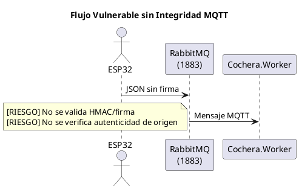
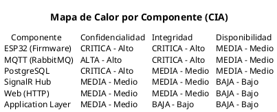

# 02 — Amenazas y Vulnerabilidades (OWASP)

## 2.1 Metodología

Se realizó un análisis de amenazas y vulnerabilidades sobre el sistema en su estado actual, aplicando los marcos **OWASP Top 10:2021** y **OWASP IoT Top 10:2018**. Cada vulnerabilidad fue puntuada con **CVSS v3.1** y mapeada a **CWE** (Common Weakness Enumeration).

Se analizaron 17 archivos de código fuente distribuidos en 5 componentes del sistema (Cochera.Web, Cochera.Worker, Cochera.Application, Cochera.Infrastructure, Firmware ESP32).

---

## 2.2 Resumen de Hallazgos

| Severidad | Cantidad | CVSS |
|-----------|----------|------|
| [CRITICA] Crítica (9.0+) | 1 | 9.1 |
| [ALTA] Alta (7.0–8.9) | 5 | 7.0–8.6 |
| [MEDIA] Media (4.0–6.9) | 7 | 4.3–6.5 |
| [BAJA] Baja (< 4.0) | 1 | 3.5 |
| **Total** | **14** | **Promedio: 6.2** |

---

## 2.3 Vulnerabilidades Identificadas

---

### V-001 — Credenciales Hardcoded en Firmware ESP32

| Campo | Valor |
|-------|-------|
| **Severidad** | [CRITICA] Crítica |
| **CVSS v3.1** | **9.1** (AV:N/AC:L/PR:N/UI:N/S:U/C:H/I:H/A:N) |
| **CWE** | CWE-798: Use of Hard-coded Credentials |
| **OWASP IoT** | I1 — Weak, Guessable, or Hardcoded Passwords |
| **Componente** | `sketch_jan16a.ino` |

**Descripción:**
El firmware del ESP32 contiene credenciales WiFi y MQTT directamente en el código fuente, sin ningún mecanismo de protección o cifrado.

**Código vulnerable:**
```cpp
// sketch_jan16a.ino
const char* ssid = "AVRIL@2014";        // WiFi SSID
const char* password = "AVRIL@2014";    // WiFi password
const char* mqtt_server = "192.168.100.16";
const int mqtt_port = 1883;
const char* mqtt_user = "esp32";         // MQTT username
const char* mqtt_pass = "123456";        // MQTT password
```

**Impacto:**
- Extracción de credenciales WiFi y MQTT mediante lectura del firmware (volcado flash)
- Acceso no autorizado a la red WiFi del estacionamiento
- Suplantación del dispositivo ESP32 en el broker MQTT
- Inyección de datos falsos de sensores al sistema

**Vector de ataque:**
1. Atacante obtiene acceso físico al ESP32 o descarga el binario
2. `esptool.py read_flash 0 0x400000 firmware.bin`
3. `strings firmware.bin | grep -i "ssid\|password\|mqtt"` revela las credenciales
4. Atacante se conecta a la red WiFi y al broker MQTT

---

### V-002 — Acceso a BD con Superusuario PostgreSQL

| Campo | Valor |
|-------|-------|
| **Severidad** | [ALTA] Alta |
| **CVSS v3.1** | **8.6** (AV:N/AC:L/PR:L/UI:N/S:C/C:H/I:N/A:N) |
| **CWE** | CWE-250: Execution with Unnecessary Privileges |
| **OWASP** | A05:2021 — Security Misconfiguration |
| **Componente** | `appsettings.json` (Web y Worker) |

**Descripción:**
La aplicación accede a PostgreSQL usando el superusuario `postgres` con contraseña `postgres`, lo que otorga privilegios máximos sobre el servidor de base de datos completo.

**Código vulnerable:**
```json
// appsettings.json (Cochera.Web y Cochera.Worker)
{
  "ConnectionStrings": {
    "DefaultConnection": "Server=localhost;Port=5432;Database=Cochera;Username=postgres;Password=postgres;"
  }
}
```

**Impacto:**
- Acceso a TODAS las bases de datos del servidor PostgreSQL
- Posibilidad de leer, modificar o eliminar cualquier dato
- Ejecución de funciones administrativas (`CREATE ROLE`, `DROP DATABASE`)
- En caso de SQL injection, el atacante hereda permisos de superusuario
- Posible ejecución de comandos del sistema operativo vía `COPY TO PROGRAM`

---

### V-003 — Inyección vía Mensajes MQTT sin Validación

| Campo | Valor |
|-------|-------|
| **Severidad** | [ALTA] Alta |
| **CVSS v3.1** | **8.1** (AV:N/AC:L/PR:L/UI:N/S:U/C:N/I:H/A:H) |
| **CWE** | CWE-20: Improper Input Validation |
| **OWASP** | A03:2021 — Injection |
| **Componente** | `MqttConsumerService.cs` |

**Descripción:**
Los mensajes MQTT recibidos se deserializan directamente sin validación de esquema, tipo o rango de valores. Un atacante con acceso al broker puede inyectar datos maliciosos.

**Código vulnerable:**
```csharp
// MqttConsumerService.cs — Deserialización sin validación
_mqttClient.ApplicationMessageReceivedAsync += async e =>
{
    var payload = Encoding.UTF8.GetString(e.ApplicationMessage.PayloadSegment);
    
    // [RIESGO]️ Deserialización directa sin validación de esquema
    var mensaje = JsonSerializer.Deserialize<MensajeSensorMqtt>(payload, 
        new JsonSerializerOptions { PropertyNameCaseInsensitive = true });

    if (mensaje != null && OnMensajeRecibido != null)
    {
        await OnMensajeRecibido.Invoke(mensaje, payload);
        e.IsHandled = true;
    }
};
```

**Impacto:**
- Inyección de lecturas de sensores falsas (cajones "ocupados" o "libres" artificialmente)
- Manipulación de sesiones de estacionamiento y cobros
- Denegación de servicio por mensajes malformados que excedan buffers
- Posible deserialización insegura si `MensajeSensorMqtt` tiene propiedades complejas

---

### V-004 — Sin Integridad en Mensajes MQTT (sin HMAC/Firma)

| Campo | Valor |
|-------|-------|
| **Severidad** | [ALTA] Alta |
| **CVSS v3.1** | **8.1** (AV:N/AC:L/PR:N/UI:N/S:U/C:N/I:H/A:L) |
| **CWE** | CWE-345: Insufficient Verification of Data Authenticity |
| **OWASP IoT** | I3 — Insecure Ecosystem Interfaces |
| **Componente** | Infraestructura MQTT (ESP32 → RabbitMQ → Worker) |

**Descripción:**
Los mensajes MQTT no incluyen ningún mecanismo de verificación de integridad (HMAC, firma digital, token). No hay forma de verificar que un mensaje proviene realmente del ESP32.

**Flujo vulnerable:**


**Impacto:**
- Suplantación completa del ESP32: cualquier cliente MQTT puede publicar en `cola_sensores`
- Inyección de eventos de sensores falsos sin que el sistema los distinga de eventos reales
- Manipulación del estado de la cochera (cajones ocupados/libres) sin detección

---

### V-005 — MQTT sin Cifrado TLS (Texto Plano en Puerto 1883)

| Campo | Valor |
|-------|-------|
| **Severidad** | [ALTA] Alta |
| **CVSS v3.1** | **7.4** (AV:A/AC:L/PR:N/UI:N/S:U/C:H/I:H/A:N) |
| **CWE** | CWE-319: Cleartext Transmission of Sensitive Information |
| **OWASP IoT** | I3 — Insecure Ecosystem Interfaces |
| **Componente** | `MqttConsumerService.cs`, `sketch_jan16a.ino`, `appsettings.json` (Worker) |

**Descripción:**
Toda la comunicación MQTT entre el ESP32 y RabbitMQ ocurre en texto plano en el puerto 1883 estándar, sin cifrado TLS.

**Código vulnerable (Worker):**
```csharp
// MqttConsumerService.cs - Conexión sin TLS
var options = new MqttClientOptionsBuilder()
    .WithTcpServer(_settings.Server, _settings.Port)  // Puerto 1883, sin TLS
    .WithCredentials(_settings.Username, _settings.Password)
    .WithCleanSession(false)
    .Build();
```

**Código vulnerable (ESP32):**
```cpp
// sketch_jan16a.ino - Conexión sin TLS
client.setServer(mqtt_server, mqtt_port);  // Puerto 1883
```

**Impacto:**
- Credenciales MQTT capturables con Wireshark en la red local
- Datos de sensores visibles en texto plano (distancias, estados)
- Man-in-the-Middle: interceptar y modificar mensajes en tránsito
- Captura pasiva de toda la telemetría IoT

---

### V-006 — IDOR en Servicios de Aplicación (sin Verificación de Ownership)

| Campo | Valor |
|-------|-------|
| **Severidad** | [ALTA] Alta |
| **CVSS v3.1** | **7.5** (AV:N/AC:L/PR:L/UI:N/S:U/C:H/I:L/A:N) |
| **CWE** | CWE-639: Authorization Bypass Through User-Controlled Key |
| **OWASP** | A01:2021 — Broken Access Control |
| **Componente** | `SesionService.cs`, `UsuarioService.cs` |

**Descripción:**
Los servicios de la capa Application reciben IDs de entidades como parámetros sin verificar que el usuario autenticado sea el propietario del recurso solicitado. Un usuario autenticado podría consultar o manipular datos de otro usuario cambiando el ID.

**Código vulnerable:**
```csharp
// SesionService.cs — Sin verificación de ownership
public async Task<SesionEstacionamientoDto?> GetByIdAsync(int id, CancellationToken ct = default)
{
    // [RIESGO]️ Cualquier usuario autenticado puede consultar cualquier sesión por ID
    var sesion = await _unitOfWork.Sesiones.GetWithPagoAsync(id, ct);
    return sesion == null ? null : MapToDto(sesion);
}

public async Task<IEnumerable<SesionEstacionamientoDto>> GetAllAsync(CancellationToken ct = default)
{
    // [RIESGO]️ Devuelve TODAS las sesiones sin filtrar por usuario
    var sesiones = await _unitOfWork.Sesiones.GetAllAsync(ct);
    return sesiones.Select(MapToDto);
}
```

**Impacto:**
- Un usuario con rol `User` podría consultar sesiones de otros usuarios
- Acceso a datos financieros (pagos) de otros usuarios
- Enumeración de sesiones incrementando el ID
- Escalación horizontal de privilegios

---

### V-007 — Sin Logging/Auditoría de Seguridad

| Campo | Valor |
|-------|-------|
| **Severidad** | [ALTA] Alta |
| **CVSS v3.1** | **7.0** (AV:N/AC:H/PR:N/UI:N/S:U/C:L/I:L/A:H) |
| **CWE** | CWE-778: Insufficient Logging |
| **OWASP** | A09:2021 — Security Logging and Monitoring Failures |
| **Componente** | `Program.cs`, sistema completo |

**Descripción:**
El sistema carece de un sistema de auditoría de seguridad. Aunque ASP.NET Core Identity genera algunos logs de autenticación, no hay logging estructurado de eventos de seguridad como intentos de login fallidos, cambios de roles, accesos denegados o actividades sospechosas.

**Configuración actual:**
```json
// appsettings.json — Solo logging genérico
{
  "Logging": {
    "LogLevel": {
      "Default": "Information",
      "Microsoft.AspNetCore": "Warning"
    }
  }
}
```

**Lo que falta:**
- No hay log de intentos de login fallidos en un formato analizable
- No hay log de accesos denegados a recursos
- No hay alertas ante patrones de ataque (fuerza bruta, enumeración)
- Los logs no se persisten (solo consola efímera)
- No hay audit trail de operaciones sensibles (cierre de sesiones, pagos)
- Sin correlación de eventos para detección de incidentes

---

### V-008 — Sin Secure Boot en ESP32

| Campo | Valor |
|-------|-------|
| **Severidad** | [MEDIA] Media |
| **CVSS v3.1** | **6.5** (AV:P/AC:L/PR:N/UI:N/S:U/C:H/I:H/A:N) |
| **CWE** | CWE-693: Protection Mechanism Failure |
| **OWASP IoT** | I5 — Lack of Secure Update Mechanism |
| **Componente** | Hardware ESP32 |

**Descripción:**
El ESP32 no tiene habilitado Secure Boot ni Flash Encryption. Esto permite leer, modificar o reemplazar el firmware sin ninguna restricción.

**Impacto:**
- Lectura del firmware y extracción de credenciales (refuerza V-001)
- Modificación del firmware para inyectar código malicioso
- Instalación de firmware personalizado que reporte datos falsos
- Clonación completa del dispositivo

---

### V-009 — SignalR Hub sin `[Authorize]` a Nivel de Clase

| Campo | Valor |
|-------|-------|
| **Severidad** | [MEDIA] Media |
| **CVSS v3.1** | **5.5** (AV:N/AC:L/PR:N/UI:N/S:U/C:L/I:L/A:N) |
| **CWE** | CWE-862: Missing Authorization |
| **OWASP** | A01:2021 — Broken Access Control |
| **Componente** | `CocheraHub.cs` |

**Descripción:**
La clase `CocheraHub` no tiene el atributo `[Authorize]` a nivel de clase. Aunque los métodos `UnirseComoAdmin()` y `UnirseComoUsuario()` están decorados individualmente con `[Authorize]`, los métodos de notificación (`NuevoEvento`, `CambioEstado`, `NuevaSesionCreada`, etc.) no tienen protección y pueden ser invocados por cualquier conexión WebSocket.

**Código vulnerable:**
```csharp
// CocheraHub.cs — Sin [Authorize] a nivel de clase
public class CocheraHub : Hub  // [RIESGO]️ Falta [Authorize]
{
    // [OK] Estos métodos SÍ están protegidos
    [Authorize(Roles = "Admin")]
    public async Task UnirseComoAdmin() { ... }

    [Authorize]
    public async Task UnirseComoUsuario(int usuarioId) { ... }

    // [RIESGO]️ Estos métodos NO están protegidos
    public async Task NuevoEvento(EventoSensorDto evento)
    {
        await Clients.All.SendAsync("RecibirEvento", evento);
    }

    public async Task CambioEstado(EstadoCocheraDto estado)
    {
        await Clients.All.SendAsync("RecibirEstado", estado);
    }

    public async Task NuevaSesionCreada(SesionEstacionamientoDto sesion) { ... }
    public async Task SolicitudCierreSesion(SesionEstacionamientoDto sesion) { ... }
    public async Task UsuarioPagoConfirmado(SesionEstacionamientoDto sesion) { ... }
    public async Task SesionCerrada(SesionEstacionamientoDto sesion) { ... }
    public async Task ActualizarMontoSesion(SesionEstacionamientoDto sesion) { ... }
}
```

**Impacto:**
- Un cliente sin autenticación puede establecer conexión WebSocket al hub
- Puede invocar `NuevoEvento` o `CambioEstado` con DTOs falsos
- Puede invocar `NuevaSesionCreada`, `SesionCerrada`, etc. con datos fabricados
- Puede broadcast a todos los clientes conectados sin autorización

---

### V-010 — Sin Headers de Seguridad HTTP

| Campo | Valor |
|-------|-------|
| **Severidad** | [MEDIA] Media |
| **CVSS v3.1** | **5.3** (AV:N/AC:L/PR:N/UI:N/S:U/C:N/I:L/A:N) |
| **CWE** | CWE-693: Protection Mechanism Failure |
| **OWASP** | A05:2021 — Security Misconfiguration |
| **Componente** | `Program.cs` |

**Descripción:**
El servidor no envía headers de seguridad HTTP estándar. Esto expone la aplicación a ataques de clickjacking, XSS y disclosure de información.

**Headers faltantes:**

| Header | Propósito | Estado |
|--------|----------|--------|
| `Content-Security-Policy` | Prevenir XSS, inyección de recursos | [FALLA] Ausente |
| `X-Frame-Options` | Prevenir clickjacking | [FALLA] Ausente |
| `X-Content-Type-Options` | Prevenir MIME type sniffing | [FALLA] Ausente |
| `Referrer-Policy` | Controlar información del referrer | [FALLA] Ausente |
| `Permissions-Policy` | Restringir APIs del navegador | [FALLA] Ausente |
| `X-XSS-Protection` | Activar filtro XSS del navegador | [FALLA] Ausente |

---

### V-011 — Sin Análisis de CVEs en Dependencias

| Campo | Valor |
|-------|-------|
| **Severidad** | [MEDIA] Media |
| **CVSS v3.1** | **5.0** (AV:N/AC:H/PR:N/UI:R/S:U/C:L/I:L/A:L) |
| **CWE** | CWE-1104: Use of Unmaintained Third-Party Components |
| **OWASP** | A06:2021 — Vulnerable and Outdated Components |
| **Componente** | Todos los proyectos (.csproj) |

**Descripción:**
No se realiza análisis periódico de vulnerabilidades conocidas (CVEs) en los paquetes NuGet del proyecto. No hay herramienta SCA integrada.

**Dependencias de riesgo:**

| Paquete | Versión | Riesgo |
|---------|---------|--------|
| MQTTnet | 4.3.3 | Librería de nicho IoT — verificar CVEs |
| Npgsql.EntityFrameworkCore.PostgreSQL | 8.0.x | Driver BD — actualizar parches |
| Radzen.Blazor | 5.x | UI de terceros — superficie amplia |
| Microsoft.AspNetCore.Identity.EntityFrameworkCore | 8.0.x | Verificar parches de seguridad |

---

### V-012 — LockoutEnabled Deshabilitado + Sin Rate Limiting

| Campo | Valor |
|-------|-------|
| **Severidad** | [MEDIA] Media |
| **CVSS v3.1** | **5.0** (AV:N/AC:L/PR:N/UI:N/S:U/C:L/I:N/A:N) |
| **CWE** | CWE-307: Improper Restriction of Excessive Authentication Attempts |
| **OWASP** | A04:2021 — Insecure Design |
| **Componente** | `CocheraDbContext.cs`, `Program.cs` |

**Descripción:**
Los usuarios seed tienen `LockoutEnabled = false`, lo que deshabilita el mecanismo anti-fuerza bruta de ASP.NET Core Identity. Además, el endpoint `/auth/login` no tiene ningún middleware de rate limiting.

**Código vulnerable (seed de usuarios):**
```csharp
// CocheraDbContext.cs — Seed de IdentityUsers
new IdentityUser
{
    Id = "1",
    UserName = "admin",
    NormalizedUserName = "ADMIN",
    LockoutEnabled = false,  // [RIESGO]️ Bloqueo por intentos fallidos deshabilitado
    // ...
}
```

**Código vulnerable (endpoint sin rate limiting):**
```csharp
// Program.cs — Sin rate limiting
app.MapPost("/auth/login", async (HttpContext httpContext, SignInManager<IdentityUser> signInManager) =>
{
    // [RIESGO]️ Se puede invocar ilimitadamente
    var result = await signInManager.PasswordSignInAsync(username, password, 
        isPersistent: false, lockoutOnFailure: true);
    // lockoutOnFailure: true PERO LockoutEnabled = false en los usuarios → no se bloquean
}).DisableAntiforgery();
```

**Nota:** Aunque `lockoutOnFailure: true` está configurado en `PasswordSignInAsync`, esto no tiene efecto porque `LockoutEnabled = false` en todos los usuarios seed. El resultado es que un atacante puede intentar infinitas combinaciones de contraseñas.

---

### V-013 — AntiForgery Deshabilitado en Endpoint de Login

| Campo | Valor |
|-------|-------|
| **Severidad** | [MEDIA] Media |
| **CVSS v3.1** | **4.3** (AV:N/AC:L/PR:N/UI:R/S:U/C:N/I:L/A:N) |
| **CWE** | CWE-352: Cross-Site Request Forgery (CSRF) |
| **OWASP** | A04:2021 — Insecure Design |
| **Componente** | `Program.cs` |

**Descripción:**
El endpoint de login tiene `.DisableAntiforgery()`, lo que permite que formularios de otros sitios realicen peticiones POST de login al servidor.

**Código vulnerable:**
```csharp
// Program.cs
app.MapPost("/auth/login", async (...) =>
{
    // ... lógica de login
}).DisableAntiforgery();  // [RIESGO]️ CSRF deshabilitado
```

**Contexto:**
Este enfoque fue necesario porque el formulario de login (`Login.razor`) se renderiza como HTML estático fuera del circuito interactivo de Blazor Server, y generar un token AntiForgery requiere configuración adicional en este escenario.

**Impacto:**
- Un sitio malicioso podría forzar al usuario a autenticarse como otro usuario (login CSRF)
- Aunque el impacto de un login CSRF es generalmente bajo, viola el principio de defensa en profundidad

---

### V-014 — MQTT Reconexión sin Backoff Exponencial

| Campo | Valor |
|-------|-------|
| **Severidad** | [BAJA] Baja |
| **CVSS v3.1** | **3.5** (AV:A/AC:L/PR:N/UI:N/S:U/C:N/I:N/A:L) |
| **CWE** | CWE-400: Uncontrolled Resource Consumption |
| **OWASP IoT** | I3 — Insecure Ecosystem Interfaces |
| **Componente** | `MqttConsumerService.cs` |

**Descripción:**
La reconexión MQTT usa un delay fijo de 5 segundos, sin backoff exponencial. Si el broker está caído por período prolongado, el servicio mantiene un ritmo de reconexión constante.

**Código vulnerable:**
```csharp
// MqttConsumerService.cs
_mqttClient.DisconnectedAsync += async e =>
{
    _logger.LogWarning("Desconectado del broker MQTT. Intentando reconectar...");
    await Task.Delay(TimeSpan.FromSeconds(5), cancellationToken);  // [RIESGO]️ Fijo, sin backoff
    
    try
    {
        await _mqttClient.ConnectAsync(options, cancellationToken);
    }
    // ...
};
```

**Impacto:**
- Consumo innecesario de recursos de red y CPU
- Posible saturación del broker al restablecerse si múltiples clientes reconectan simultáneamente
- En escenarios de múltiples ESP32, amplifica el problema

---

## 2.4 Matriz OWASP Top 10:2021

| Categoría OWASP | Vulnerabilidades | Cantidad |
|-----------------|-----------------|----------|
| A01 — Broken Access Control | V-006, V-009 | 2 |
| A02 — Cryptographic Failures | V-005 | 1 |
| A03 — Injection | V-003 | 1 |
| A04 — Insecure Design | V-012, V-013 | 2 |
| A05 — Security Misconfiguration | V-002, V-010 | 2 |
| A06 — Vulnerable and Outdated Components | V-011 | 1 |
| A07 — Identification and Authentication Failures | — | 0 |
| A08 — Software and Data Integrity Failures | — | 0 |
| A09 — Security Logging and Monitoring Failures | V-007 | 1 |
| A10 — Server-Side Request Forgery | — | 0 |

## 2.5 Matriz OWASP IoT Top 10:2018

| Categoría OWASP IoT | Vulnerabilidades | Cantidad |
|---------------------|-----------------|----------|
| I1 — Weak, Guessable, or Hardcoded Passwords | V-001 | 1 |
| I2 — Insecure Network Services | — | 0 |
| I3 — Insecure Ecosystem Interfaces | V-004, V-005, V-014 | 3 |
| I4 — Lack of Secure Update Mechanism | — | 0 |
| I5 — Use of Insecure or Outdated Components | V-008 | 1 |

---

## 2.6 Mapa de Calor por Componente



| Componente | Vulnerabilidades | CVSS Máximo |
|-----------|-----------------|-------------|
| ESP32 / Firmware | V-001, V-008 | 9.1 |
| MQTT / RabbitMQ | V-003, V-004, V-005, V-014 | 8.1 |
| PostgreSQL / Infra | V-002 | 8.6 |
| Cochera.Application | V-006 | 7.5 |
| Cochera.Web (SignalR) | V-009 | 5.5 |
| Cochera.Web (HTTP) | V-010, V-012, V-013 | 5.3 |
| Todos | V-007, V-011 | 7.0 |

---


