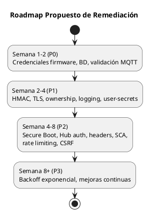

# 04 — Propuesta de Mejoras de Seguridad

## 4.1 Criterios de Priorización

Las mejoras se priorizan según impacto y esfuerzo:

| Prioridad | Descripción | SLA |
|-----------|------------|-----|
| **P0 — Urgente** | Vulnerabilidades críticas que deben resolverse inmediatamente | 1-3 días |
| **P1 — Alta** | Vulnerabilidades altas que requieren atención en el sprint actual | 1-2 semanas |
| **P2 — Media** | Vulnerabilidades medias para planificar en el próximo sprint | 2-4 semanas |
| **P3 — Baja** | Mejoras de defensa en profundidad y buenas prácticas | 1-2 meses |

---

## 4.2 Propuestas de Mejora

---

### M-01 — Externalizar Credenciales del Firmware ESP32

| Campo | Valor |
|-------|-------|
| **Prioridad** | P0 — Urgente |
| **Vulnerabilidades** | V-001 |
| **Esfuerzo** | ~4-8 horas |
| **Impacto** | CVSS 9.1 → 2.0 |

**Propuesta:**
Almacenar credenciales WiFi y MQTT en NVS (Non-Volatile Storage) del ESP32 con opción de configuración por portal cautivo (WiFiManager).

**Implementación:**
```cpp
#include <Preferences.h>
#include <WiFiManager.h>

Preferences preferences;

void setup() {
    // WiFiManager configura WiFi por portal cautivo
    WiFiManager wm;
    wm.autoConnect("Cochera-Setup");
    
    // Credenciales MQTT desde NVS
    preferences.begin("mqtt", true);
    String mqtt_server = preferences.getString("server", "");
    String mqtt_user = preferences.getString("user", "");
    String mqtt_pass = preferences.getString("pass", "");
    preferences.end();
}
```

**Adicionalmente:**
- Habilitar Flash Encryption del ESP32 para proteger NVS
- Habilitar Secure Boot para evitar reemplazo del firmware

---

### M-02 — Crear Usuario de BD con Privilegios Mínimos

| Campo | Valor |
|-------|-------|
| **Prioridad** | P0 — Urgente |
| **Vulnerabilidades** | V-002 |
| **Esfuerzo** | ~1-2 horas |
| **Impacto** | CVSS 8.6 → 2.0 |

**Propuesta:**
Crear un usuario PostgreSQL dedicado con permisos CRUD únicamente sobre la base de datos `Cochera`.

**Implementación:**
```sql
-- Crear usuario dedicado
CREATE USER cochera_app WITH PASSWORD 'C0ch3ra_S3cur3!2024';

-- Otorgar permisos mínimos
GRANT CONNECT ON DATABASE "Cochera" TO cochera_app;
GRANT USAGE ON SCHEMA public TO cochera_app;
GRANT SELECT, INSERT, UPDATE, DELETE ON ALL TABLES IN SCHEMA public TO cochera_app;
GRANT USAGE, SELECT ON ALL SEQUENCES IN SCHEMA public TO cochera_app;

-- Denegar DDL
REVOKE CREATE ON SCHEMA public FROM cochera_app;
```

**Actualizar appsettings.json:**
```json
{
  "ConnectionStrings": {
    "DefaultConnection": "Server=localhost;Port=5432;Database=Cochera;Username=cochera_app;Password=C0ch3ra_S3cur3!2024;"
  }
}
```

---

### M-03 — Validar Esquema de Mensajes MQTT

| Campo | Valor |
|-------|-------|
| **Prioridad** | P0 — Urgente |
| **Vulnerabilidades** | V-003 |
| **Esfuerzo** | ~2-4 horas |
| **Impacto** | CVSS 8.1 → 3.0 |

**Propuesta:**
Agregar validación de esquema, rango de valores y sanitización antes de procesar mensajes MQTT.

**Implementación:**
```csharp
// MqttMessageValidator.cs (nuevo)
public static class MqttMessageValidator
{
    public static bool IsValid(MensajeSensorMqtt? mensaje, out string error)
    {
        error = string.Empty;
        
        if (mensaje == null) { error = "Mensaje nulo"; return false; }
        
        if (string.IsNullOrWhiteSpace(mensaje.Tipo))
        { error = "Tipo requerido"; return false; }
        
        var tiposValidos = new[] { "entrada", "cajon1", "cajon2", "estado" };
        if (!tiposValidos.Contains(mensaje.Tipo.ToLower()))
        { error = $"Tipo inválido: {mensaje.Tipo}"; return false; }
        
        if (mensaje.Distancia < 0 || mensaje.Distancia > 400)
        { error = $"Distancia fuera de rango: {mensaje.Distancia}"; return false; }
        
        if (mensaje.Timestamp > DateTime.UtcNow.AddMinutes(5))
        { error = "Timestamp en el futuro"; return false; }
        
        return true;
    }
}

// En MqttConsumerService.cs
var mensaje = JsonSerializer.Deserialize<MensajeSensorMqtt>(payload, jsonOpts);

if (!MqttMessageValidator.IsValid(mensaje, out var error))
{
    _logger.LogWarning("[RIESGO]️ Mensaje MQTT rechazado: {Error}. Payload: {Payload}", error, payload);
    return;
}
```

---

### M-04 — Agregar HMAC a Mensajes MQTT

| Campo | Valor |
|-------|-------|
| **Prioridad** | P1 — Alta |
| **Vulnerabilidades** | V-004 |
| **Esfuerzo** | ~4-8 horas |
| **Impacto** | CVSS 8.1 → 2.0 |

**Propuesta:**
Incluir un HMAC-SHA256 en cada mensaje MQTT para verificar autenticidad e integridad. Clave compartida almacenada en NVS del ESP32.

**ESP32 (envío):**
```cpp
#include <mbedtls/md.h>

String computeHMAC(const char* payload, const char* key) {
    byte hmacResult[32];
    mbedtls_md_context_t ctx;
    mbedtls_md_init(&ctx);
    mbedtls_md_setup(&ctx, mbedtls_md_info_from_type(MBEDTLS_MD_SHA256), 1);
    mbedtls_md_hmac_starts(&ctx, (const unsigned char*)key, strlen(key));
    mbedtls_md_hmac_update(&ctx, (const unsigned char*)payload, strlen(payload));
    mbedtls_md_hmac_finish(&ctx, hmacResult);
    mbedtls_md_free(&ctx);
    // Convert to hex...
    return hexString;
}
```

**Worker (verificación):**
```csharp
using var hmac = new HMACSHA256(Encoding.UTF8.GetBytes(sharedKey));
var computed = Convert.ToHexString(hmac.ComputeHash(Encoding.UTF8.GetBytes(payload)));
if (!computed.Equals(receivedHmac, StringComparison.OrdinalIgnoreCase))
{
    _logger.LogWarning("[RIESGO]️ HMAC inválido. Mensaje rechazado.");
    return;
}
```

---

### M-05 — Habilitar TLS en MQTT

| Campo | Valor |
|-------|-------|
| **Prioridad** | P1 — Alta |
| **Vulnerabilidades** | V-005 |
| **Esfuerzo** | ~4-8 horas |
| **Impacto** | CVSS 7.4 → 2.0 |

**Propuesta:**
Configurar RabbitMQ con TLS en puerto 8883. Actualizar clientes (Worker y ESP32) para usar conexión cifrada.

**Worker (.NET):**
```csharp
var options = new MqttClientOptionsBuilder()
    .WithTcpServer(_settings.Server, 8883)
    .WithTlsOptions(o => o
        .UseTls(true)
        .WithCertificateValidationHandler(_ => true)) // En dev; validar cert en prod
    .WithCredentials(_settings.Username, _settings.Password)
    .Build();
```

**ESP32:**
```cpp
#include <WiFiClientSecure.h>
WiFiClientSecure espSecureClient;
espSecureClient.setCACert(ca_cert);  // Certificado CA del broker
PubSubClient client(espSecureClient);
client.setServer(mqtt_server, 8883);
```

---

### M-06 — Agregar Verificación de Ownership en Servicios

| Campo | Valor |
|-------|-------|
| **Prioridad** | P1 — Alta |
| **Vulnerabilidades** | V-006 |
| **Esfuerzo** | ~4-6 horas |
| **Impacto** | CVSS 7.5 → 2.0 |

**Propuesta:**
Agregar parámetro `currentUserId` a los métodos de servicio y verificar que el usuario solo pueda acceder a sus propios recursos (excepto Admin).

**Implementación:**
```csharp
public async Task<SesionEstacionamientoDto?> GetByIdAsync(
    int id, int currentUserId, bool isAdmin, CancellationToken ct = default)
{
    var sesion = await _unitOfWork.Sesiones.GetWithPagoAsync(id, ct);
    if (sesion == null) return null;
    
    if (!isAdmin && sesion.UsuarioId != currentUserId)
        throw new UnauthorizedAccessException("No tiene acceso a esta sesión");
    
    return MapToDto(sesion);
}
```

---

### M-07 — Implementar Logging Estructurado de Seguridad

| Campo | Valor |
|-------|-------|
| **Prioridad** | P1 — Alta |
| **Vulnerabilidades** | V-007 |
| **Esfuerzo** | ~4-8 horas |
| **Impacto** | CVSS 7.0 → 2.0 |

**Propuesta:**
Instalar Serilog con sink a archivo/Seq y crear categoría de logs de seguridad.

**Implementación:**
```csharp
// Program.cs
builder.Host.UseSerilog((context, config) => config
    .ReadFrom.Configuration(context.Configuration)
    .Enrich.FromLogContext()
    .WriteTo.Console()
    .WriteTo.File("logs/security-.log", 
        rollingInterval: RollingInterval.Day,
        restrictedToMinimumLevel: LogEventLevel.Warning));

// SecurityLogger (nuevo servicio)
public class SecurityLogger
{
    private readonly ILogger<SecurityLogger> _logger;
    
    public void LogLoginFailed(string username, string ip)
        => _logger.LogWarning("SECURITY: Login failed for {Username} from {IP}", username, ip);
    
    public void LogAccessDenied(string username, string resource)
        => _logger.LogWarning("SECURITY: Access denied for {Username} to {Resource}", username, resource);
    
    public void LogSuspiciousActivity(string type, string details)
        => _logger.LogError("SECURITY: Suspicious activity [{Type}]: {Details}", type, details);
}
```

---

### M-08 — Habilitar Secure Boot + Flash Encryption en ESP32

| Campo | Valor |
|-------|-------|
| **Prioridad** | P2 — Media |
| **Vulnerabilidades** | V-008 |
| **Esfuerzo** | ~4-8 horas |
| **Impacto** | CVSS 6.5 → 2.0 |

**Propuesta:**
Habilitar Secure Boot V2 y Flash Encryption mediante `menuconfig` de ESP-IDF.

```bash
# En ESP-IDF menuconfig
idf.py menuconfig
# Security features → Enable hardware Secure Boot V2
# Security features → Enable flash encryption on boot
# NOTA: ¡Proceso irreversible! Probar primero en dispositivo de prueba.
```

---

### M-09 — Agregar `[Authorize]` a Nivel de Clase en CocheraHub

| Campo | Valor |
|-------|-------|
| **Prioridad** | P2 — Media |
| **Vulnerabilidades** | V-009 |
| **Esfuerzo** | ~30 minutos |
| **Impacto** | CVSS 5.5 → 0 |

**Propuesta:**
Agregar `[Authorize]` a nivel de clase y ajustar `OnConnectedAsync` para rechazar conexiones no autenticadas.

**Implementación:**
```csharp
[Authorize]  // ← Agregar esto
public class CocheraHub : Hub
{
    // Todos los métodos ahora requieren autenticación
    // El Worker invoca SignalR vía HTTP, no directamente como cliente del Hub
}
```

**Verificar:** Que `SignalRNotificationService` (Worker) use un token o mecanismo de autenticación al conectarse al HubUrl.

---

### M-10 — Agregar Headers de Seguridad HTTP

| Campo | Valor |
|-------|-------|
| **Prioridad** | P2 — Media |
| **Vulnerabilidades** | V-010 |
| **Esfuerzo** | ~1 hora |
| **Impacto** | CVSS 5.3 → 0 |

**Implementación:**
```csharp
// Program.cs — Agregar middleware de headers
app.Use(async (context, next) =>
{
    context.Response.Headers.Append("X-Content-Type-Options", "nosniff");
    context.Response.Headers.Append("X-Frame-Options", "DENY");
    context.Response.Headers.Append("X-XSS-Protection", "1; mode=block");
    context.Response.Headers.Append("Referrer-Policy", "strict-origin-when-cross-origin");
    context.Response.Headers.Append("Permissions-Policy", 
        "camera=(), microphone=(), geolocation=()");
    context.Response.Headers.Append("Content-Security-Policy", 
        "default-src 'self'; script-src 'self' 'unsafe-inline' 'unsafe-eval'; " +
        "style-src 'self' 'unsafe-inline'; img-src 'self' data:; " +
        "connect-src 'self' ws: wss:;");
    await next();
});
```

---

### M-11 — Integrar Análisis SCA de Dependencias

| Campo | Valor |
|-------|-------|
| **Prioridad** | P2 — Media |
| **Vulnerabilidades** | V-011 |
| **Esfuerzo** | ~2-4 horas |
| **Impacto** | CVSS 5.0 → 1.0 |

**Propuesta:**
Integrar `dotnet list package --vulnerable` y/o Snyk en pipeline CI.

```yaml
# GitHub Actions
- run: dotnet list package --vulnerable --include-transitive
  continue-on-error: false
```

---

### M-12 — Habilitar LockoutEnabled + Rate Limiting

| Campo | Valor |
|-------|-------|
| **Prioridad** | P2 — Media |
| **Vulnerabilidades** | V-012 |
| **Esfuerzo** | ~2-4 horas |
| **Impacto** | CVSS 5.0 → 1.0 |

**Propuesta:**
1. Cambiar `LockoutEnabled = true` en seed de usuarios
2. Agregar ASP.NET Core Rate Limiting al endpoint de login

**Seed corregida:**
```csharp
new IdentityUser
{
    UserName = "admin",
    LockoutEnabled = true,  // [OK] Bloqueo habilitado
    // ...
}
```

**Rate Limiting:**
```csharp
// Program.cs
builder.Services.AddRateLimiter(options =>
{
    options.AddFixedWindowLimiter("login", limiter =>
    {
        limiter.PermitLimit = 5;
        limiter.Window = TimeSpan.FromMinutes(1);
        limiter.QueueProcessingOrder = QueueProcessingOrder.OldestFirst;
    });
});

app.UseRateLimiter();

app.MapPost("/auth/login", async (...) => { ... })
    .RequireRateLimiting("login")
    .DisableAntiforgery();
```

---

### M-13 — Restaurar AntiForgery en Login

| Campo | Valor |
|-------|-------|
| **Prioridad** | P2 — Media |
| **Vulnerabilidades** | V-013 |
| **Esfuerzo** | ~2-4 horas |
| **Impacto** | CVSS 4.3 → 0 |

**Propuesta:**
Generar y validar un token AntiForgery en el formulario de login. Requiere inyectar `IAntiforgery` en la página estática o usar un campo hidden con el token.

```csharp
// En Login.razor (cambiar a static SSR con token)
@inject Microsoft.AspNetCore.Antiforgery.IAntiforgery Antiforgery
@{
    var token = Antiforgery.GetAndStoreTokens(HttpContext);
}

<form method="post" action="/auth/login">
    <input type="hidden" name="__RequestVerificationToken" value="@token.RequestToken" />
    <!-- resto del formulario -->
</form>

// En Program.cs: quitar .DisableAntiforgery()
app.MapPost("/auth/login", async (...) => { ... });
```

---

### M-14 — Implementar Backoff Exponencial en Reconexión MQTT

| Campo | Valor |
|-------|-------|
| **Prioridad** | P3 — Baja |
| **Vulnerabilidades** | V-014 |
| **Esfuerzo** | ~1 hora |
| **Impacto** | CVSS 3.5 → 0 |

**Implementación:**
```csharp
private int _reconnectAttempt = 0;

_mqttClient.DisconnectedAsync += async e =>
{
    var delay = Math.Min(60, Math.Pow(2, _reconnectAttempt)) 
                + Random.Shared.Next(0, 1000) / 1000.0;
    _logger.LogWarning("Reconexión MQTT intento {Attempt}, delay {Delay}s", 
        _reconnectAttempt, delay);
    await Task.Delay(TimeSpan.FromSeconds(delay), cancellationToken);
    
    try
    {
        await _mqttClient.ConnectAsync(options, cancellationToken);
        _reconnectAttempt = 0; // Reset en conexión exitosa
    }
    catch
    {
        _reconnectAttempt++;
    }
};
```

---

### M-15 — Mover Credenciales a User Secrets / Variables de Entorno

| Campo | Valor |
|-------|-------|
| **Prioridad** | P1 — Alta |
| **Vulnerabilidades** | V-002 |
| **Esfuerzo** | ~1-2 horas |
| **Impacto** | CVSS 8.6 → 3.0 |

**Propuesta:**
Usar `dotnet user-secrets` en desarrollo y variables de entorno en producción.

```bash
# Desarrollo
dotnet user-secrets set "ConnectionStrings:DefaultConnection" "Server=localhost;Port=5432;Database=Cochera;Username=cochera_app;Password=C0ch3ra_S3cur3!2024;"
dotnet user-secrets set "Mqtt:Password" "nueva_password_segura"
```

```csharp
// Program.cs — Ya soportado por default
builder.Configuration.AddUserSecrets<Program>();
// En producción: variable de entorno
// ConnectionStrings__DefaultConnection=...
```

---

### M-16 — Remover Credenciales de Prueba de la Página de Login

| Campo | Valor |
|-------|-------|
| **Prioridad** | P2 — Media |
| **Vulnerabilidades** | V-012 |
| **Esfuerzo** | ~30 minutos |
| **Impacto** | Reduce exposición de información |

**Propuesta:**
Mostrar credenciales de prueba solo en entorno de desarrollo.

```razor
@* Login.razor *@
@inject IWebHostEnvironment Env

@if (Env.IsDevelopment())
{
    <div class="alert alert-info">
        <strong>Credenciales de prueba:</strong>
        <p>Admin: admin / Admin12345</p>
        <p>Usuario: usuario_1 / Usuario12345</p>
    </div>
}
```

---

## 4.3 Resumen de Propuestas por Prioridad

| Prioridad | Mejoras | Vulnerabilidades |
|-----------|---------|-----------------|
| **P0** (1-3 días) | M-01, M-02, M-03 | V-001, V-002, V-003 |
| **P1** (1-2 semanas) | M-04, M-05, M-06, M-07, M-15 | V-004, V-005, V-006, V-007 |
| **P2** (2-4 semanas) | M-08, M-09, M-10, M-11, M-12, M-13, M-16 | V-008, V-009, V-010, V-011, V-012, V-013 |
| **P3** (1-2 meses) | M-14 | V-014 |

## 4.4 Estimación de Esfuerzo Total

| Prioridad | Horas Estimadas |
|-----------|----------------|
| P0 | 7-14h |
| P1 | 17-32h |
| P2 | 12-22h |
| P3 | 1h |
| **Total** | **37-69h** |

---

## 4.5 Roadmap Propuesto



---


