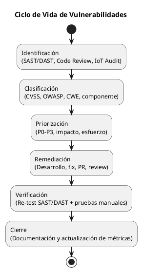
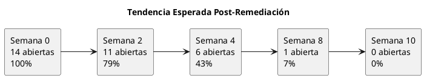
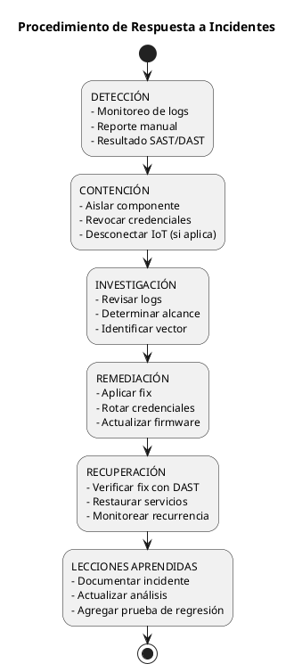

# 06 — Gestión de Vulnerabilidades y Parcheo

## 6.1 Ciclo de Vida de Vulnerabilidades

### 6.1.1 Proceso de Gestión



### 6.1.2 SLAs por Severidad

| Severidad | CVSS | SLA Remediación | SLA Verificación | Escalación |
|-----------|------|----------------|-----------------|------------|
| [CRITICA] Crítica | 9.0+ | 1-3 días | +1 día | Inmediata al líder |
| [ALTA] Alta | 7.0-8.9 | 1-2 semanas | +3 días | Sprint actual |
| [MEDIA] Media | 4.0-6.9 | 2-4 semanas | +1 semana | Próximo sprint |
| [BAJA] Baja | < 4.0 | 1-2 meses | +2 semanas | Backlog |

---

## 6.2 Inventario de Vulnerabilidades Abiertas

### 6.2.1 Vista General

| Estado | Cantidad |
|--------|----------|
| [CRITICA] Abierta — Crítica | 1 |
| [ALTA] Abierta — Alta | 5 |
| [MEDIA] Abierta — Media | 7 |
| [BAJA] Abierta — Baja | 1 |
| **Total Abiertas** | **14** |

### 6.2.2 Detalle de Vulnerabilidades Abiertas

| ID | Vulnerabilidad | CVSS | Prioridad | SLA | Estado |
|----|---------------|------|-----------|-----|--------|
| V-001 | Credenciales hardcoded en firmware ESP32 | 9.1 | P0 | 1-3 días | [CRITICA] Abierta |
| V-002 | Acceso a BD con superusuario PostgreSQL | 8.6 | P0 | 1-3 días | [CRITICA] Abierta |
| V-003 | Inyección vía mensajes MQTT sin validación | 8.1 | P0 | 1-3 días | [CRITICA] Abierta |
| V-004 | Sin integridad en mensajes MQTT (sin HMAC) | 8.1 | P1 | 1-2 semanas | [ALTA] Abierta |
| V-005 | MQTT sin cifrado TLS (texto plano) | 7.4 | P1 | 1-2 semanas | [ALTA] Abierta |
| V-006 | IDOR — sin verificación de ownership | 7.5 | P1 | 1-2 semanas | [ALTA] Abierta |
| V-007 | Sin logging/auditoría de seguridad | 7.0 | P1 | 1-2 semanas | [ALTA] Abierta |
| V-008 | Sin Secure Boot en ESP32 | 6.5 | P2 | 2-4 semanas | [MEDIA] Abierta |
| V-009 | SignalR Hub sin `[Authorize]` a nivel de clase | 5.5 | P2 | 2-4 semanas | [MEDIA] Abierta |
| V-010 | Sin headers de seguridad HTTP | 5.3 | P2 | 2-4 semanas | [MEDIA] Abierta |
| V-011 | Sin análisis de CVEs en dependencias | 5.0 | P2 | 2-4 semanas | [MEDIA] Abierta |
| V-012 | LockoutEnabled deshabilitado + sin rate limiting | 5.0 | P2 | 2-4 semanas | [MEDIA] Abierta |
| V-013 | AntiForgery deshabilitado en endpoint de login | 4.3 | P2 | 2-4 semanas | [MEDIA] Abierta |
| V-014 | MQTT reconexión sin backoff exponencial | 3.5 | P3 | 1-2 meses | [BAJA] Abierta |

---

## 6.3 Plan de Remediación

### 6.3.1 Sprint 1 — P0: Críticas (Semana 1-2)

| Tarea | Vulnerabilidad | Mejora | Esfuerzo |
|-------|---------------|--------|----------|
| Externalizar credenciales ESP32 a NVS + WiFiManager | V-001 | M-01 | 4-8h |
| Crear usuario BD con privilegios mínimos | V-002 | M-02 | 1-2h |
| Agregar validación de esquema MQTT | V-003 | M-03 | 2-4h |

**Criterio de aceptación:** Las 3 vulnerabilidades P0 deben estar cerradas y verificadas.

### 6.3.2 Sprint 2 — P1: Altas (Semana 2-4)

| Tarea | Vulnerabilidad | Mejora | Esfuerzo |
|-------|---------------|--------|----------|
| Implementar HMAC-SHA256 en mensajes MQTT | V-004 | M-04 | 4-8h |
| Habilitar TLS en comunicación MQTT (8883) | V-005 | M-05 | 4-8h |
| Agregar verificación de ownership en servicios | V-006 | M-06 | 4-6h |
| Implementar Serilog + logging de seguridad | V-007 | M-07 | 4-8h |
| Mover credenciales a User Secrets / env vars | V-002 | M-15 | 1-2h |

### 6.3.3 Sprint 3 — P2: Medias (Semana 4-8)

| Tarea | Vulnerabilidad | Mejora | Esfuerzo |
|-------|---------------|--------|----------|
| Habilitar Secure Boot + Flash Encryption | V-008 | M-08 | 4-8h |
| Agregar `[Authorize]` al Hub SignalR | V-009 | M-09 | 30 min |
| Agregar headers de seguridad HTTP | V-010 | M-10 | 1h |
| Integrar SCA en pipeline CI | V-011 | M-11 | 2-4h |
| Habilitar LockoutEnabled + Rate Limiting | V-012 | M-12 | 2-4h |
| Restaurar AntiForgery en login | V-013 | M-13 | 2-4h |
| Remover credenciales de prueba de UI | V-012 | M-16 | 30 min |

### 6.3.4 Continua — P3: Bajas (Semana 8+)

| Tarea | Vulnerabilidad | Mejora | Esfuerzo |
|-------|---------------|--------|----------|
| Implementar backoff exponencial MQTT | V-014 | M-14 | 1h |

---

## 6.4 Proceso de Verificación Post-Remediación

### 6.4.1 Checklist de Cierre por Vulnerabilidad

Para cerrar una vulnerabilidad, se deben cumplir **todos** los criterios:

- [ ] Fix implementado y mergeado a rama principal
- [ ] Code review aprobado por al menos 1 revisor
- [ ] Tests unitarios nuevos pasan (si aplica)
- [ ] SAST no reporta el hallazgo original
- [ ] DAST re-ejecutado para el test case específico
- [ ] Prueba manual confirma que la vulnerabilidad ya no es explotable
- [ ] Documentación actualizada (este directorio)

### 6.4.2 Criterios de Re-test por Tipo

| Tipo | Método de Verificación |
|------|----------------------|
| Credenciales hardcoded | `strings firmware.bin` no revela credenciales |
| BD con superusuario | Conexión con nuevo usuario, `SELECT current_user` muestra `cochera_app` |
| MQTT sin validación | Enviar JSON malformado, verificar rechazo en logs |
| MQTT sin TLS | Wireshark en puerto 8883 muestra tráfico cifrado |
| IDOR | Acceder a sesión de otro usuario, verificar `403 Forbidden` |
| Hub sin Authorize | Conexión WebSocket sin cookie, verificar `401` |
| Sin headers | `curl -I` muestra headers CSP, X-Frame-Options, etc. |
| Sin rate limiting | 100 intentos de login, verificar bloqueo después de 5 |

---

## 6.5 Métricas de Seguridad

### 6.5.1 KPIs a Monitorear

| Métrica | Valor Actual | Meta |
|---------|-------------|------|
| Vulnerabilidades abiertas — Críticas | 1 | 0 |
| Vulnerabilidades abiertas — Altas | 5 | 0 |
| Vulnerabilidades abiertas — Medias | 7 | ≤ 3 |
| Vulnerabilidades abiertas — Bajas | 1 | ≤ 3 |
| CVSS promedio | 6.2 | < 4.0 |
| CVSS máximo | 9.1 | < 7.0 |
| Tasa de aprobación DAST | 45% (9/20) | > 85% |
| Días sin vulnerabilidades P0 | 0 | > 30 |
| Dependencias con CVEs conocidos | Sin verificar | 0 |

### 6.5.2 Tendencia Esperada Post-Remediación



---

## 6.6 Plan de Respuesta a Incidentes

### 6.6.1 Procedimiento



### 6.6.2 Contactos de Escalación

| Nivel | Rol | Responsabilidad |
|-------|-----|----------------|
| L1 | Desarrollador | Clasificación inicial, fix de vulnerabilidades P2-P3 |
| L2 | Líder de Equipo | Decisión sobre P0-P1, coordinación de remediación |
| L3 | Asesor de Seguridad | Análisis forense, respuesta a incidentes críticos |

---

## 6.7 Gestión de Parches de Dependencias

### 6.7.1 Política de Actualización

| Tipo de Actualización | Frecuencia | Acción |
|----------------------|-----------|--------|
| Parches de seguridad (CVE) | Inmediata | Aplicar en 48h, test, deploy |
| Actualizaciones menores | Quincenal | Revisar changelog, test, deploy |
| Actualizaciones mayores | Trimestral | Evaluar breaking changes, planificar migración |

### 6.7.2 Monitoreo Automatizado

```bash
# Ejecutar semanalmente o en CI
dotnet list package --vulnerable --include-transitive

# Dependabot (GitHub) o Renovate para PRs automáticos
# configurar .github/dependabot.yml
```

---


