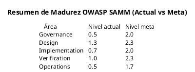

# 07 — Conclusiones y Reflexiones

## 7.1 Resumen Ejecutivo

Se realizó un análisis exhaustivo de seguridad sobre el sistema **Cochera Inteligente**, evaluando 17 archivos de código fuente distribuidos en 5 componentes: Cochera.Web, Cochera.Worker, Cochera.Application, Cochera.Infrastructure y el firmware ESP32.

### Hallazgos Principales

| Métrica | Valor |
|---------|-------|
| Vulnerabilidades identificadas | 14 |
| Hallazgos de código inseguro | 16 |
| Propuestas de mejora | 16 |
| CVSS promedio | 6.2 |
| CVSS máximo | 9.1 (V-001: Credenciales hardcoded en ESP32) |
| Tasa de aprobación DAST | 45% (9/20 tests pasan) |
| Archivos con hallazgos | 9 de 17 analizados |

### Distribución de Vulnerabilidades

| Severidad | Cantidad | % |
|-----------|----------|---|
| [CRITICA] Crítica | 1 | 7% |
| [ALTA] Alta | 5 | 36% |
| [MEDIA] Media | 7 | 50% |
| [BAJA] Baja | 1 | 7% |

---

## 7.2 Evaluación de Madurez (OWASP SAMM)

Se evaluó la madurez de seguridad del sistema usando el modelo **OWASP SAMM** (Software Assurance Maturity Model) en una escala de 0 a 3:

| Práctica SAMM | Nivel Actual | Nivel Meta | Brecha |
|---------------|-------------|-----------|--------|
| **Governance** — Strategy & Metrics | 0.5 | 2.0 | [RIESGO]️ Sin métricas de seguridad formales |
| **Governance** — Policy & Compliance | 0.5 | 1.5 | [RIESGO]️ Sin políticas de seguridad documentadas |
| **Governance** — Education & Guidance | 0.5 | 1.5 | [RIESGO]️ Sin capacitación formal pero con conocimiento práctico |
| **Design** — Threat Assessment | 1.5 | 2.5 | Este análisis establece la línea base |
| **Design** — Security Requirements | 1.0 | 2.0 | [RIESGO]️ Requisitos implícitos, no documentados |
| **Design** — Security Architecture | 1.5 | 2.5 | Clean Architecture bien definida, auth implementada |
| **Implementation** — Secure Build | 0.5 | 2.0 | [RIESGO]️ Sin pipeline CI/CD de seguridad |
| **Implementation** — Secure Deployment | 0.5 | 2.0 | [RIESGO]️ Sin hardening de producción |
| **Implementation** — Defect Management | 1.0 | 2.0 | Este documento establece el proceso |
| **Verification** — Architecture Assessment | 1.5 | 2.5 | Este análisis cubre este punto |
| **Verification** — Requirements Testing | 0.5 | 2.0 | [RIESGO]️ Sin tests de seguridad automatizados |
| **Verification** — Security Testing | 1.0 | 2.5 | Checklist DAST definido, sin ejecución automatizada |
| **Operations** — Incident Management | 0.5 | 2.0 | [RIESGO]️ Plan definido, sin implementación |
| **Operations** — Environment Management | 0.5 | 1.5 | [RIESGO]️ Sin hardening de infraestructura |
| **Operations** — Operational Management | 0.5 | 1.5 | [RIESGO]️ Sin monitoreo ni alertas |

**Nivel promedio actual: 0.8 / 3.0**
**Nivel meta: 2.0 / 3.0**

---

## 7.3 Fortalezas del Sistema

A pesar de las vulnerabilidades identificadas, el sistema cuenta con controles de seguridad importantes:

### 7.3.1 Autenticación Robusta
- **ASP.NET Core Identity** con `IdentityUser`, `IdentityRole`, y `PasswordHasher`
- Hashing PBKDF2-HMAC-SHA256 con salt automático para contraseñas
- Cookie HTTP-only (`Cochera.Auth`) con sliding expiration de 8 horas
- Separación de autenticación (`IdentityUser`) y dominio (`Usuario`)

### 7.3.2 Autorización por Roles
- Roles `Admin` y `User` con `AuthorizeRouteView` en todas las rutas Blazor
- `[Authorize(Roles = "Admin")]` en métodos críticos del Hub SignalR
- Validación de identidad en `UnirseComoUsuario()` que verifica ownership

### 7.3.3 Arquitectura Clean
- Separación clara de responsabilidades (Domain → Application → Infrastructure → Web)
- Patrón Unit of Work para transacciones de base de datos
- DTOs que previenen exposición directa de entidades

### 7.3.4 Validación de Redirect
- El endpoint de login valida `returnUrl` para prevenir open redirect
- Requiere URI relativa que comience con `/`

---

## 7.4 Áreas de Mayor Riesgo

### 7.4.1 Comunicación IoT (CVSS 7.4-9.1)
La comunicación entre el ESP32 y el sistema backend es la superficie de ataque más crítica:
- Credenciales en texto plano en firmware (V-001)
- Comunicación MQTT sin cifrado TLS (V-005)
- Sin integridad ni autenticidad de mensajes (V-004)
- Sin validación de datos recibidos (V-003)

Un atacante con acceso a la red local podría capturar, inyectar o modificar datos de sensores, manipulando el estado completo de la cochera.

### 7.4.2 Infraestructura de Base de Datos (CVSS 8.6)
El acceso con superusuario PostgreSQL (V-002) amplifica cualquier vulnerabilidad que permita interactuar con la base de datos. En caso de inyección SQL (actualmente mitigado por Entity Framework), las consecuencias serían catastróficas.

### 7.4.3 Control de Acceso Granular (CVSS 5.5-7.5)
Aunque la autenticación y autorización por roles están bien implementadas, falta:
- Verificación de ownership en la capa de servicios (V-006)
- Protección completa del Hub SignalR (V-009)

---

## 7.5 Recomendaciones Priorizadas

### Inmediatas (P0 — esta semana)
1. **Crear usuario PostgreSQL dedicado** con privilegios CRUD mínimos (V-002, M-02) — 1h, impacto máximo
2. **Validar esquema de mensajes MQTT** antes de procesarlos (V-003, M-03) — 2h
3. **Mover credenciales a NVS/WiFiManager** en ESP32 (V-001, M-01) — 4h

### Corto plazo (P1 — próximas 2 semanas)
4. **Habilitar TLS en MQTT** para cifrar comunicación IoT (V-005, M-05)
5. **Agregar HMAC** a mensajes MQTT para verificar autenticidad (V-004, M-04)
6. **Verificación de ownership** en servicios de aplicación (V-006, M-06)
7. **Logging estructurado** con Serilog (V-007, M-07)

### Mediano plazo (P2 — próximo mes)
8. **`[Authorize]` en CocheraHub** a nivel de clase (V-009, M-09) — 30 min, quick win
9. **Headers de seguridad HTTP** (V-010, M-10) — 1h, quick win
10. **Rate limiting + LockoutEnabled** (V-012, M-12)

---

## 7.6 Conclusión

El sistema Cochera Inteligente presenta una base arquitectónica sólida con autenticación y autorización correctamente implementadas. Sin embargo, la **comunicación IoT** es el eslabón más débil de la cadena de seguridad, con credenciales hardcoded, comunicación sin cifrar y sin mecanismos de integridad.

Las 14 vulnerabilidades identificadas son abordables con un esfuerzo estimado de **37-69 horas** de desarrollo, priorizando las 3 vulnerabilidades P0 (credenciales ESP32, superusuario BD, validación MQTT) que pueden resolverse en la primera semana.

La implementación del plan de remediación propuesto llevaría la tasa de aprobación DAST del **45% actual al 95%+** y el nivel OWASP SAMM de **0.8 a 2.0**, estableciendo una postura de seguridad adecuada para un sistema IoT de gestión de estacionamiento.

---

## 7.7 Referencias

| Referencia | URL |
|------------|-----|
| OWASP Top 10:2021 | https://owasp.org/Top10/ |
| OWASP IoT Top 10:2018 | https://owasp.org/www-project-internet-of-things/ |
| OWASP SAMM | https://owaspsamm.org/ |
| CWE Top 25 | https://cwe.mitre.org/top25/ |
| CVSS v3.1 Calculator | https://www.first.org/cvss/calculator/3.1 |
| ASP.NET Core Security | https://learn.microsoft.com/aspnet/core/security/ |
| ESP32 Secure Boot | https://docs.espressif.com/projects/esp-idf/en/latest/esp32/security/secure-boot-v2.html |
| MQTTnet Documentation | https://github.com/dotnet/MQTTnet |
| RabbitMQ TLS | https://www.rabbitmq.com/ssl.html |

---

